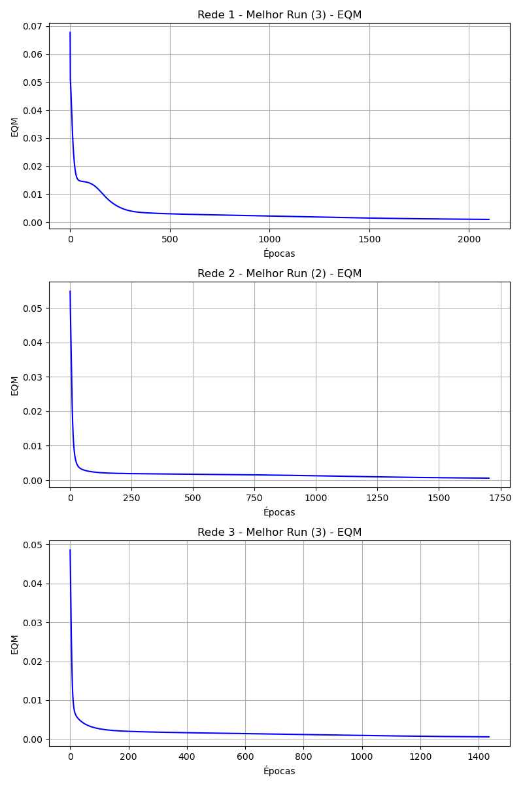
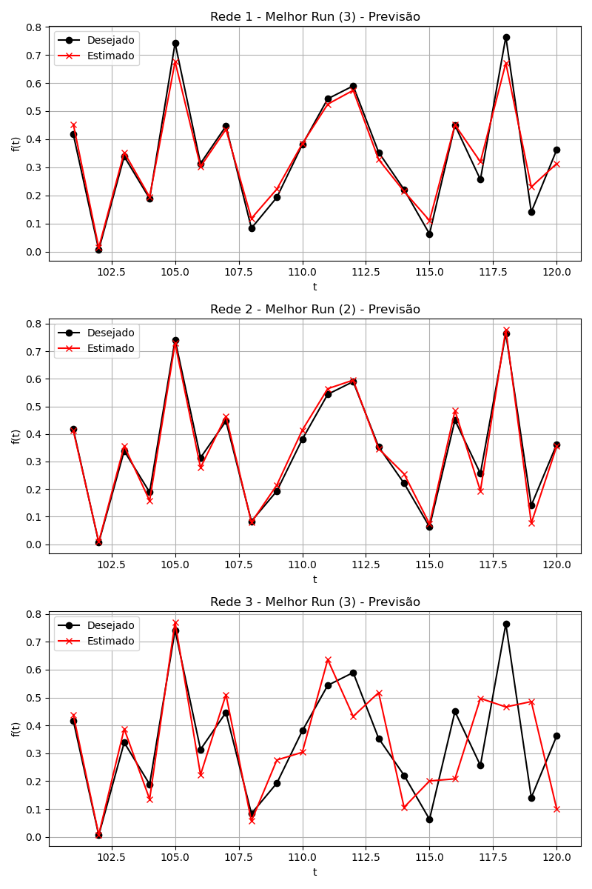

# Respostas - Módulo PMC 3

## 1. Descrição do Problema e Topologias TDNN
O problema consiste na previsão de uma série temporal de preços do mercado financeiro usando uma **Time Delay Neural Network (TDNN)**. A rede utiliza uma janela deslizante de tamanho `p` para observar os instantes anteriores e prever o valor do instante atual `f(t)`.  

Foram avaliadas 3 topologias com diferentes tamanhos de janela e número de neurônios na camada oculta:

- **Rede 1:** p = 5, N1 = 10  
- **Rede 2:** p = 10, N1 = 15  
- **Rede 3:** p = 15, N1 = 25  

---

## 2. Tabela de Treinamentos

| Topologia | Treinamento | EQM       | Épocas |
|-----------|------------|-----------|--------|
| Rede 1    | 1º (T1)    | 0.000872  | 2039   |
| Rede 1    | 2º (T2)    | 0.000997  | 3076   |
| Rede 1    | 3º (T3)    | 0.000994  | 2101   |
| Rede 2    | 1º (T1)    | 0.000779  | 1923   |
| Rede 2    | 2º (T2)    | 0.000587  | 1704   |
| Rede 2    | 3º (T3)    | 0.000732  | 1621   |
| Rede 3    | 1º (T1)    | 0.000720  | 1513   |
| Rede 3    | 2º (T2)    | 0.000632  | 1529   |
| Rede 3    | 3º (T3)    | 0.000558  | 1436   |

---

## 3. Gráficos EQM
Abaixo estão os gráficos do **Erro Quadrático Médio (EQM)** em função das épocas para o melhor treinamento de cada topologia.

---

## 4. Tabela de Validação (Teste)

| Amostra | f(t) Desejado | Estimado Rede 1 (Melhor) | Estimado Rede 2 (Melhor) | Estimado Rede 3 (Melhor) |
|---------|---------------|--------------------------|--------------------------|--------------------------|
| t = 101 | 0.4173        | 0.4534                   | 0.4120                   | 0.4383                   |
| t = 102 | 0.0062        | 0.0142                   | 0.0088                   | 0.0083                   |
| t = 103 | 0.3387        | 0.3531                   | 0.3564                   | 0.3875                   |
| t = 104 | 0.1886        | 0.1945                   | 0.1579                   | 0.1353                   |
| t = 105 | 0.7418        | 0.6759                   | 0.7285                   | 0.7708                   |
| t = 106 | 0.3138        | 0.3027                   | 0.2779                   | 0.2228                   |
| t = 107 | 0.4466        | 0.4353                   | 0.4644                   | 0.5104                   |
| t = 108 | 0.0835        | 0.1182                   | 0.0795                   | 0.0567                   |
| t = 109 | 0.1930        | 0.2227                   | 0.2149                   | 0.2759                   |
| t = 110 | 0.3807        | 0.3840                   | 0.4140                   | 0.3036                   |
| t = 111 | 0.5438        | 0.5247                   | 0.5640                   | 0.6360                   |
| t = 112 | 0.5897        | 0.5739                   | 0.5952                   | 0.4326                   |
| t = 113 | 0.3536        | 0.3280                   | 0.3465                   | 0.5174                   |
| t = 114 | 0.2210        | 0.2143                   | 0.2551                   | 0.1063                   |
| t = 115 | 0.0631        | 0.1107                   | 0.0740                   | 0.2008                   |
| t = 116 | 0.4499        | 0.4513                   | 0.4841                   | 0.2083                   |
| t = 117 | 0.2564        | 0.3195                   | 0.1936                   | 0.4970                   |
| t = 118 | 0.7642        | 0.6711                   | 0.7789                   | 0.4663                   |
| t = 119 | 0.1411        | 0.2301                   | 0.0764                   | 0.4856                   |
| t = 120 | 0.3626        | 0.3134                   | 0.3555                   | 0.1002                   |

---

### Erro Relativo Médio (%) e Variância

| Topologia | Treinamento | Erro Relativo Médio (%) | Variância do Erro |
|-----------|------------|------------------------|-----------------|
| Rede 1    | T1         | 47.38%                 | 3339.67         |
| Rede 1    | T2         | 29.82%                 | 1725.19         |
| Rede 1    | T3         | 21.20%                 | 1032.92         |
| Rede 2    | T1         | 12.65%                 | 157.25          |
| Rede 2    | T2         | 11.43%                 | 159.61          |
| Rede 2    | T3         | 16.08%                 | 166.71          |
| Rede 3    | T1         | 85.53%                 | 13262.42        |
| Rede 3    | T2         | 56.38%                 | 4649.99         |
| Rede 3    | T3         | 54.36%                 | 3946.66         |

---

## 5. Gráficos Estimado vs. Desejado
Abaixo estão os gráficos comparando o valor desejado com o estimado pela rede durante a fase de teste (previsão iterativa).

---

## 6. Seleção da Melhor Topologia
A **Rede 2**, especificamente no **treinamento 2**, ofereceu a melhor previsão, com um **Erro Relativo Médio de 11.43%**.  

**Justificativa:**  
- A Rede 2 possui um equilíbrio adequado entre a janela de memória (p=10) e a capacidade da rede (15 neurônios ocultos).  
- A Rede 1 (p=5) demonstrou pouca capacidade preditiva devido à janela muito pequena.  
- A Rede 3 (p=15, 25 neurônios) tem muitos parâmetros e, dado que o conjunto de treinamento possui apenas cerca de 85 padrões, ocorreu **overfitting**, prejudicando severamente a generalização iterativa no período de teste.

---

## 7. Resilient Propagation (RProp)
O algoritmo **RProp (Resilient Backpropagation)** é uma adaptação heurística do Backpropagation projetada para contornar o problema de dependência do gradiente nas taxas de convergência. Em vez de usar a magnitude do gradiente para atualizar os pesos, o RProp usa apenas o **sinal** da derivada parcial.

**Características:**
- Mantém um passo de atualização individual para cada peso.  
- Se o gradiente mantiver o mesmo sinal por duas épocas consecutivas, o tamanho do passo aumenta (acelera a convergência).  
- Se o sinal mudar (indicando que passou do mínimo local), o tamanho do passo diminui.  

**Vantagens:**
- Não sofre com a saturação de funções de ativação (*vanishing gradient*).  
- Rápida convergência na maioria dos cenários.  
- Não requer ajuste manual da taxa de aprendizado (η) como o Backpropagation tradicional.

---

## 8. Levenberg-Marquardt (LM)
O algoritmo **Levenberg-Marquardt (LM)** é um método avançado de otimização de redes neurais que aproxima o comportamento do método de Newton sem calcular a matriz Hessiana diretamente.

**Características:**
- Utiliza o cálculo da **Matriz Jacobiana** (derivadas de primeira ordem dos erros em relação aos pesos) para aproximar a matriz Hessiana.  
- Combina características de gradiente descendente (longe do mínimo) e do método de Gauss-Newton (perto do mínimo).  

**Vantagens:**
- Considerado um dos algoritmos de treinamento mais rápidos para redes neurais de tamanho pequeno e médio.  
- Converge em consideravelmente menos épocas que algoritmos baseados apenas em gradiente.  
- Excelente para problemas de regressão e aproximação de funções que busquem um erro quadrático mínimo (MSE).  

**Desvantagens:**
- Requer muito mais memória RAM para a construção e inversão da matriz Jacobiana, limitando sua escalabilidade para redes muito profundas ou datasets grandes.