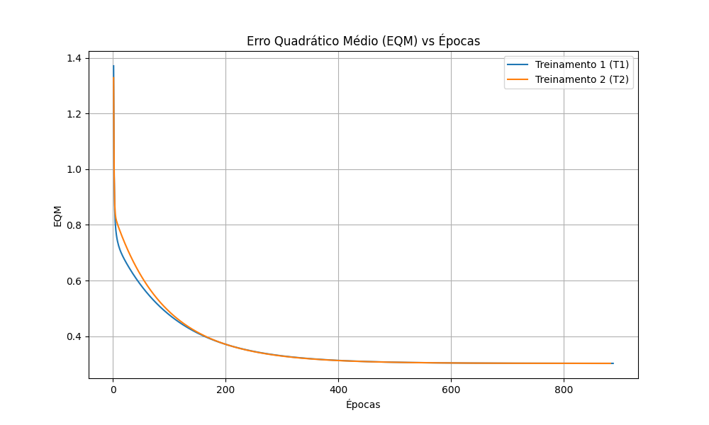

# Respostas

## 1. Rede ADALINE

O algoritmo de treinamento da Regra Delta foi aplicado a uma rede ADALINE para a classificação de sinais referentes a um processo industrial. Foram realizados 5 treinamentos independentes, cada qual com uma inicialização aleatória dos pesos sinápticos entre 0 e 1, adotando-se uma taxa de aprendizado $\eta = 0.0025$ e uma precisão $\epsilon = 10^{-6}$.

## 2. Treinamentos e Pesos

| Treinamento | Vetor de Pesos Inicial ($w_0, w_1, w_2, w_3, w_4$) | Vetor de Pesos Final ($w_0, w_1, w_2, w_3, w_4$) | Número de Épocas |
|---|---|---|---|
| **1º (T1)** | 0.3745, 0.9507, 0.7320, 0.5987, 0.1560 | -1.8130, 1.3129, 1.6423, -0.4275, -1.1778 | 888 |
| **2º (T2)** | 0.1151, 0.6091, 0.1334, 0.2406, 0.3271 | -1.8131, 1.3128, 1.6422, -0.4277, -1.1777 | 883 |
| **3º (T3)** | 0.8348, 0.1048, 0.7446, 0.3605, 0.3593 | -1.8131, 1.3129, 1.6423, -0.4277, -1.1778 | 914 |
| **4º (T4)** | 0.9890, 0.5495, 0.2814, 0.0773, 0.4445 | -1.8131, 1.3129, 1.6423, -0.4277, -1.1778 | 921 |
| **5º (T5)** | 0.7838, 0.6348, 0.2490, 0.7581, 0.3131 | -1.8132, 1.3129, 1.6424, -0.4276, -1.1778 | 932 |

## 3. Gráfico do Erro Quadrático Médio (EQM)

O gráfico a seguir apresenta a evolução do Erro Quadrático Médio (EQM) em função do número de épocas para os dois primeiros treinamentos (T1 e T2).

## 4. Classificação das Amostras de Teste

Utilizando as 5 redes treinadas, procedeu-se com a classificação do conjunto de amostras. A regra de decisão adota a válvula A para valores calculados $y \leq 0$ (saída classificada como -1) e a válvula B para valores $y > 0$ (saída classificada como +1). Os resultados de cada treinamento são apresentados na tabela abaixo.

| Amostra | $x_1$ | $x_2$ | $x_3$ | $x_4$ | y (T1) | y (T2) | y (T3) | y (T4) | y (T5) | Válvula Recomendada |
|---|---|---|---|---|---|---|---|---|---|---|
| **1** | 0.9694 | 0.6909 | 0.4334 | 3.4965 | -1 | -1 | -1 | -1 | -1 | **Válvula A** |
| **2** | 0.5427 | 1.3832 | 0.6390 | 4.0352 | -1 | -1 | -1 | -1 | -1 | **Válvula A** |
| **3** | 0.6081 | -0.9196 | 0.5925 | 0.1016 | 1 | 1 | 1 | 1 | 1 | **Válvula B** |
| **4** | -0.1618 | 0.4694 | 0.2030 | 3.0117 | -1 | -1 | -1 | -1 | -1 | **Válvula A** |
| **5** | 0.1870 | -0.2578 | 0.6124 | 1.7749 | -1 | -1 | -1 | -1 | -1 | **Válvula A** |
| **6** | 0.4891 | -0.5276 | 0.4378 | 0.6439 | 1 | 1 | 1 | 1 | 1 | **Válvula B** |
| **7** | 0.3777 | 2.0149 | 0.7423 | 3.3932 | 1 | 1 | 1 | 1 | 1 | **Válvula B** |
| **8** | 1.1498 | -0.4067 | 0.2469 | 1.5866 | 1 | 1 | 1 | 1 | 1 | **Válvula B** |
| **9** | 0.9325 | 1.0950 | 1.0359 | 3.3591 | 1 | 1 | 1 | 1 | 1 | **Válvula B** |
| **10** | 0.5060 | 1.3317 | 0.9222 | 3.7174 | -1 | -1 | -1 | -1 | -1 | **Válvula A** |
| **11** | 0.0497 | -2.0656 | 0.6124 | -0.6585 | -1 | -1 | -1 | -1 | -1 | **Válvula A** |
| **12** | 0.4004 | 3.5369 | 0.9766 | 5.3532 | 1 | 1 | 1 | 1 | 1 | **Válvula B** |
| **13** | -0.1874 | 1.3343 | 0.5374 | 3.2189 | -1 | -1 | -1 | -1 | -1 | **Válvula A** |
| **14** | 0.5060 | 1.3317 | 0.9222 | 3.7174 | -1 | -1 | -1 | -1 | -1 | **Válvula A** |
| **15** | 1.6375 | -0.7911 | 0.7537 | 0.5515 | 1 | 1 | 1 | 1 | 1 | **Válvula B** |

## 5. Análise dos Pesos e Convergência

**Pergunta:** Embora o número de épocas de cada treinamento realizado no item 2 seja diferente, explique por que então os valores dos pesos continuam praticamente inalterados.

**Resposta:** O ADALINE (Adaptative Linear Element) utiliza uma função de ativação linear e seu algoritmo de treinamento (Regra Delta) tem como objetivo minimizar o Erro Quadrático Médio (EQM). A superfície de erro que representa o EQM do ADALINE em relação aos pesos é um paraboloide (uma parábola n-dimensional), que possui a propriedade convexa de conter **um único mínimo global**. 

Isso significa que, independentemente do conjunto de pesos iniciais adotado (que é o ponto de partida do algoritmo na superfície de erro) ou do número de épocas que a descida do gradiente levará para convergir, os pesos sempre convergirão invariavelmente em direção ao mesmo ponto de mínimo global. Portanto, as flutuações e diferenças marginais após o treinamento devem-se estritamente à precisão fixada de $10^{-6}$ e à limitação matemática na convergência iterativa, mas os valores finais dos vetores de pesos resultam essencialmente nos mesmos.
